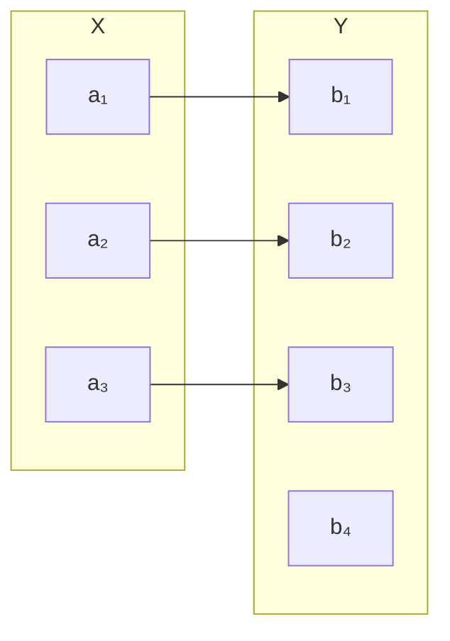
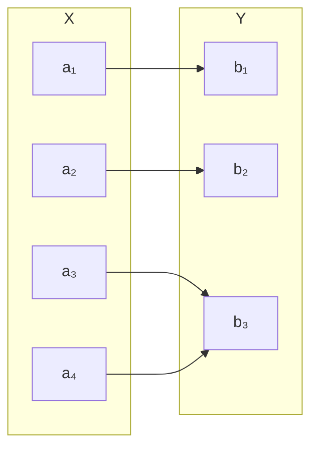
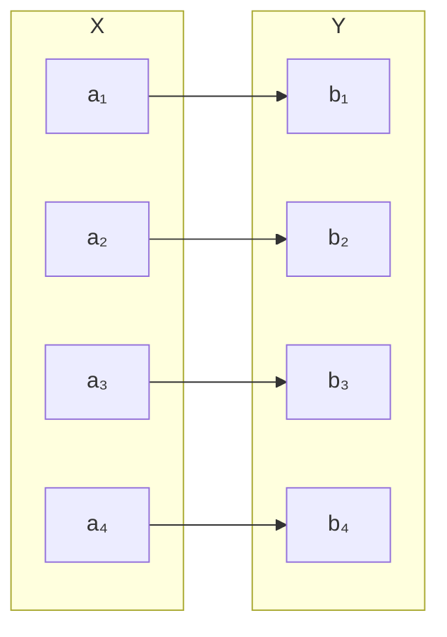

# Category Theory
## Category: $\mathbb{C}$
- Functor Category
	- Objects: Functors.
- Group Category / Grp / Gp
	- Objects: Groups.
	- Morphism: гомоморфизмы групп
- Set Category: Set
	- Objects: Sets.
	- Morphism: Function. Like: $f$.
- Top Category
- _K_-Vect Category
## Functor
Functor Defenition:
$\mathbb{F}: \mathbb{C} \to \mathbb{D}$
- $\mathbb F$: Functor.
- $\mathbb C, \mathbb D$: Category.
Функтор $\mathbb F \in \mathbb C$ в $\mathbb D$ это отображение между категориями:
- сопоставляет каждый объект $\mathbb X \in \mathbb C$ объекту $\mathbb{F}(\mathbb{X}) \in \mathbb{D}$
- сопоставляет каждый морфизм $f: \mathbb{X} \to \mathbb{Y}$ в $\mathbb C$ морфизму $\mathbb{F}(f): \mathbb{F}(\mathbb{X}) \to \mathbb{F}(\mathbb{Y})$ в $\mathbb D$, соблюдая условия:
	- $\mathbb F(id_\mathbb X) = id_{\mathbb F(\mathbb X)}$ для каждого объекта $\mathbb X$ в $\mathbb C$: Identity element.
	- $\mathbb F(g \circ f)$ для всех морфизмов $f: \mathbb X \to \mathbb Y$ и $g: \mathbb Y \to \mathbb Z$ в $\mathbb C$: Сomposition of morphisms.
## Эндофунктор:
- $F: \mathbb{C} \to \mathbb{C}$.
- Монада — это моноид в категории эндофункторов.
## Morphism:
Notation: $f: \mathbb{X} \to \mathbb{Y}$.
Morphism Defenition: Morphism это связь между двумя объектами в категории.
Morphism Properties:
- $\forall f: A \to B, \, g: B \to C \quad \exists \quad g \circ f: A \to C$: Композиционность для морфизмов выраженных функцией.
	- [[Math-AA-Semigroup Theory#^bec8b6|Ассоциативность]] композиций.
- [[Math-AA-Category Theory#Тождественный морфизм|Тождественный морфизм]].
- [[Math-AA-Magma Theory#^ec0681|Сlosure/замкнутость]] категории относительно морфизмов.
	- $\forall f \in \text{Hom}_\mathbb{C}(A, B)$:
	-   $\text{Hom}_\mathbb{C}(A, B) = \{f \mid f: A \to B, f \in \mathbb{C}\}$
		- $f$: конкретный morphism из элемента множества в элемент множества.
		- $\text{Hom}_\mathbb{C}(A, B)$: `==` $\mathbb{A} \to \mathbb{B} \in \mathbb{C}$: Множество вариантов морфизмов $\mathbb{A} \to \mathbb{B}$.
		- $\mid$: такой что
## Инъекция, сюръекция, биекция, общее отображение
### Set-Monomorphism:
- $\mathbb{C}$-Monomorphism Properties:
	- $f \circ g_1 = f \circ g_2 \implies g_1 = g_2$
		- $Z \xrightarrow{g_1, g_2} A \xrightarrow{f} B$
		- Это свойство говорит о том, что f различает входящие морфизмы в A. Если композиции $f \circ g_1$ и $f \circ g_2$ совпадают, то $g_1$ и $g_2$ должны быть одинаковыми.
- Set-Monomorphism Properties:
	- $\mathbb{C}$-Monomorphism
	- Injection.
### Injection:
- $\forall{x,x'}\in{X}:f(x)={f(x')}\iff{x={x'}}$ : Если образ один и тот же, то это одно и то же значение, т.к. в Set не может быть одинаковых хначений.
	-  $\forall{x_1,x_2}\in{X}:f(x_1)\neq{f(x_2)}\iff{x_1}\neq{x_2}$: Образ уникальный

Формально, функция $f: X \to Y$ является инъекцией, если выполняется:
$\forall x, x{\prime} \in X, \quad f(x) = f(x{\prime}) \implies x = x{\prime}$.
Это означает, что:
	•	Если два элемента $x$ и $x{\prime}$из X имеют одинаковый образ $(f(x) = f(x{\prime}))$, то это должны быть одни и те же элементы $(x = x{\prime})$.

Право:
- $\text{Im}(f) \subseteq Y$: Образ не обязан покрывать весь кодомен и может выступть подмножеством.

### Epimorphism:
- $\mathbb{C}$-Epimorphism:
	- $g_1 \circ f = g_2 \circ f \implies g_1 = g_2$
		- $\mathbb{A} \xrightarrow{f} \mathbb{B} \xrightarrow{g_1, g_2} \mathbb{Z}$
		- Эпиморфизм гарантирует, что f позволяет “различать” два выходящих морфизма $g_1$ и $g_2$. Если композиции $g_1 \circ f$ и $g_2 \circ f$ совпадают, это возможно только если $g_1 = g_2$.
- Set-Epimorphism properties:
	- $\mathbb{C}$-Epimorphism.
	- Surjection.
### Surjection:
- $\text{Im}(f) = Y$: Образ полный.
	- $\text{Im}(f)$: Множество морфизмов.
	- $\forall y \in Y \, \exists x \in X, \, f(x) = y$
Right:
$\exists x_1, x_2 \in X, \, x_1 \neq x_2, \, f(x_1) = f(x_2)$

### Bimorphism:
- Epimorphism
- Monomorphism
### Bijection / Биективный морфизм / Bijective morphism
- Injection.
- Surjection.
- Set/Bimorphism == Set/Bijection

### Изоморфизм:
Properties:
- [[Math-AA-Category Theory#Bijection / Биективный морфизм|Биективный морфизм]].
- $\forall f: \mathbb{A} \to \mathbb{B} \quad \exists \quad f^{-1}: \mathbb{B} \to \mathbb{A}$: Прямой и обратный морфизмы.
	- $f \circ f^{-1} = \text{id}_\mathbb{B}, \quad f^{-1} \circ f = \text{id}_\mathbb{A}$: Свойства композиции.
		- $f^{-1} \circ f(x) = x, \, \forall x \in \mathbb{A}$
	- Example: $\mathbb{A} = \{1\}, \quad \mathbb{B} = \{a\}$.
		- $f: \mathbb{A} \to \mathbb{B}: f(1)=a$
		- $f^{-1}: \mathbb{B} \to \mathbb{A}: f^{-1}(a) = 1$
		- $f \circ f^{-1} = \text{id}_\mathbb{B}: f(f^{-1}(a)) = f(1) = a$
		- $f^{-1} \circ f = \text{id}_\mathbb{A}: f^{-1}(f(1)) = f^{-1}(a) = 1$
- Set-Homomorphism
### Summary
![[Screenshot 2024-12-22 at 21.53.58.png|300]]

| Mapping Type | Set          | Полный образ | Уникальный образ |
| ------------ | ------------ | ------------ | ---------------- |
| Injective    | Monomorphism |              | $+$              |
| Surjective   | Epimorphism  | $+$          |                  |
| Bijective    | Isomorphism  | $+$          | $+$              |
| General      | Morphism     |              |                  |
## Reversion:
$f:A\implies{B}$
$g:B\implies{A}$

$f(a)=b$
$(f\circ{g})(b)=f(g(b))=b$: $Id_B$ / Identyty $B$

$g(b)=a$
$(g\circ{f})(a)=g(f(a))=a$: $Id_A$ : Identyty $A$
## Структуросохраняющий морфизм / Structure-preserving morphism / Homomorphism
- Set-Homomorphism
- $f: \mathbb{A} \to \mathbb{A}: \forall a, b \in \mathbb{A}: f(a \circ b) = f(a) \circ f(b)$
## Эндоморфизм:
- Homomorphism
- $f: \mathbb{A} \to \mathbb{A}$: Морфизм из объекта $\mathbb{A}$ в объект $\mathbb{A}$.
	- $(\text{dom}(f) = \text{cod}(f) = \mathbb{G}$
### Automorphism / Aвтоморфизм Неинволютивный
 - [[Math-AA-Category Theory#Эндоморфизм|Эндоморфизм]]:
	 - Closery.
 - [[Math-AA-Category Theory#Изоморфизм|Изоморфизм]]:
	 - Inverse Element.
	 - Neutral Element
	 - Associativity
### Инволютивный Автоморфизм / Involutive Automorphism:
-  $f: \mathbb{A} \to \mathbb{A}: f \circ f = \text{id}_\mathbb{A}$: Инволютивность.
	- $\forall x \in \mathbb{A}:f(f(x)) = x$
Examples:
1. $f: (\mathbb{Z}, +) \to (\mathbb{Z}, +), \quad f(x) = -x.$
$f(f(x)) = f(-x) = -(-x) = x$
2. $f: (\mathbb{R}^*, *) \to (\mathbb{R}^*, *), \quad f(x) = \frac{1}{x}$
$f(f(x)) = f\left(\frac{1}{x}\right) = \frac{1}{\frac{1}{x}} = x$
> Инволютивный Автоморфизм это Неинволютивный Aвтоморфизм со свойством Инволютивности.
### Тождественный морфизм / Identity Morphism:
 Properties:
- Инволютивный Aвтоморфизм.
- $\text{id}_\mathbb{A}: A \to A$: Самосоответствие.
	- $\text{id}_\mathbb{A}$ для композиций в теории категорий это аналог $e$ для $\circ$ в теории групп.
	- Natation: $\text{id}_\mathbb{A}$: Читаестся как тождественный морфизм объекта $\mathbb{A}$.
	-  $\forall{f: A \to B}: f \circ \text{id}_\mathbb{A} = \text{id}_\mathbb{A} \circ f = f$.

> Тождественный морфизм это Инволютивный Автоморфизм со свойством самосоответствия.

## Retraction / Реторакция (morphism):
- Set-Retraction Properties:
	- $\forall s: A \to B, \, A \subseteq B \, \exists r: B \to A$,
		- где  $r \circ s = \text{id}_A$ .
	- Example: $\forall{f: A\{1, 2\} \to B\{1, 2, 3\}, r: B\{1, 2, 3\} \to A\{1, 2\}}: r(f(2)) = 2,  r(f(1)) = 1$
		- s: Section
		- r: Retraction
- Idempotence Property: $r \circ r = r$
## Section (morphism)
See Retraction.
## Идемпотентность/Idempotence Property:
Set–Idempotence:
- $\forall f: \mathbb{A} \to \mathbb{A}: f \circ f = f$
	- $\forall f: \{1, 2\} \to \{1\}: f(f(2))=1,  f(f(1))=1$
## Zero Morphism
- Set Zero Morphism:
	- $f: A \to \emptyset \quad \text{(если \(B = \emptyset\))}.$
***
## Miscellaneous:
***
## Little Dictionary:
- **Domain** do‧main /dōˈmān/. Множество входных параметров функции. Synonyms: Прообраз.
- **Co-domain**: Множество выходных параметров. Synonyms: Output / `returns` (Solidity) / Образ.
- **Injection**: One-to-One. inj. Инъекция.
- **Surjection**: Сурьекция.
- $f\circ{g}=f(g)$
	- $(f \circ g)(x) = f(g(x))$
- Morphism | Морфизм / mapping | отображение / реформация / function | функция / стрелка / $\to$ /
	- homomorphism | гомоморфизм: $\text{homomorphism} \in \text{Morphism}$.
	- **Isomorphism | Изоморфизм**:  Synonyms: Bijection | Биекция.
	- **Automorphism | Афтоморфизм**: Synonyms:  endofunctor | эндофунктор. Морфизм отображащийся сам в себя.
		- Endomrphism | Эндоморфизм
	- Идеморфизм | Тождественный морфизм
- Commutation | Коммутация.
- **Structure-preserving | Cохраняющий структуру**
- Variables:
	- $\mathbb{G}$: Множество.
	- $Aut(\mathbb{G})$: Множество автоморфизмов множества $\mathbb{G}$.
- Domain | Домен: Множество слева.
	- Прообраз это множество принадлежащее домену
- Co-domain | Кодомен: Множество справа.
	- Образ: Может не покрывать весь кодомен, являясь его подмножеством.
		- Im.
		- Image.
***
External Links:
***
Internal Links:
$\bigtriangleup$ [[Object-Oriented Programming]]
$\bigtriangleup$ [[Формальное Моделирование]]
$\bigtriangleup$ [[Math-0Mathematics]]
$\bigcirc$
$\bigtriangledown$ [[Haskell]]
$\bigtriangledown$ [[Math-Set Theory|Set Theory]]
***
Tags: #OOP
***
Nested Tags:
***
Search:
***
***